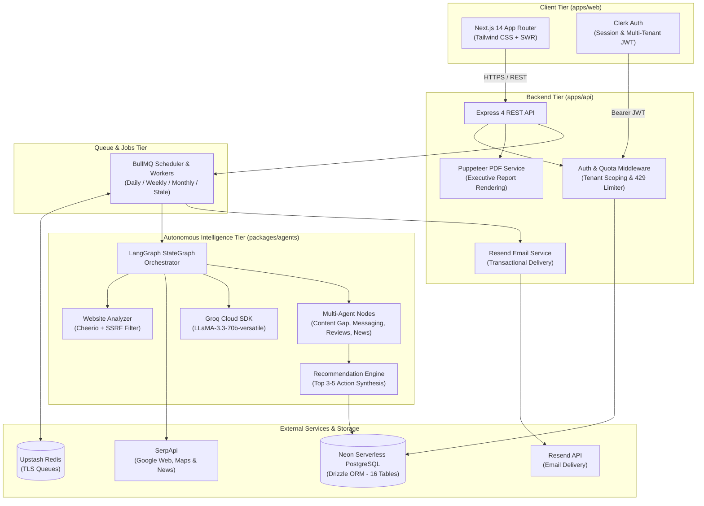

<div id="top">

<!-- HEADER STYLE: CLASSIC -->
<div align="center">


# <code>SERP-SCOUT</code>

<em>AI-Powered Competitive Intelligence & SEO Action Engine for Small Businesses</em>

<p><strong>"Success is measured by real business outcomes rather than a 'visibility score.'"</strong></p>

<!-- BADGES -->
<p>
  
  
  
  
  
  
  
  
  
  
  
  
  
</p>

</div>
<br>

---

## 📑 Table of Contents

- [Overview](#-overview)
- [Key Features](#-key-features)
- [System Architecture](#-system-architecture)
- [Monorepo Structure](#-monorepo-structure)
- [Agent Roster](#-agent-roster)
- [Getting Started](#-getting-started)
  - [Prerequisites](#prerequisites)
  - [Environment Configuration](#environment-configuration)
  - [Installation & Setup](#installation--setup)
  - [Running the Applications](#running-the-applications)
  - [Verification & Testing](#verification--testing)
- [Security & Compliance Guardrails](#-security--compliance-guardrails)
- [License](#-license)

---

## 💡 Overview

Small business owners don't need vanity SEO scores (Domain Authority, Page Authority, or arbitrary "Visibility Indexes"). They need to know:
1. **Who is taking revenue and appointments from them right now?**
2. **Where are the concrete gaps in services, location coverage, and keyword queries?**
3. **What specific, prioritized actions (maximum 3 to 5) should they take this week to drive real calls and bookings?**

**Serp-Scout** is an autonomous multi-agent intelligence platform that continuously analyzes local search engine result pages (Google Web, Local Map Packs, and News), identifies direct local rivals, tracks striking-distance ranking opportunities, and delivers human-readable, evidence-grounded action plans directly to the business owner via interactive web dashboards, downloadable PDF reports, and automated email briefings.

---

## 🚀 Key Features

* **Autonomous Website Extraction & Enrichment**: Securely scrapes a business's homepage, extracts title/meta tags, headings, content text, detected services, and schema markup, then uses Groq LLaMA 3 to extract structured business profiles.
* **SerpApi Multi-Engine Search Layer**: Normalizes Google Organic, Google Maps (Local 3-Pack), People Also Ask (PAA), Related Searches, and Google News results.
* **Competitor Discovery & Heuristic Scoring**: Uncovers true local business competitors without requiring the owner to know rival names in advance. Classifies domains as `direct_competitor`, `indirect_competitor`, or `directory_aggregator` with human-in-the-loop review.
* **Opportunity Radar & Keyword Ranking Deltas**: Discovers high-conversion keywords, scores them using a multi-factor formula (Business Relevance, Commercial Intent, Ranking Potential, Local Market Fit, Content Gap), and calculates historical rank deltas ($\Delta \text{rank}$).
* **Multi-Agent Deep Intelligence**:
  - **Content Gap Agent**: Compares business offerings against competitor pages.
  - **Messaging & Positioning Agent**: Contrasts value propositions and call-to-actions.
  - **Review & Reputation Agent**: Synthesizes ratings, review velocity, and customer sentiment.
  - **Local SERP Presence Agent**: Evaluates Google Maps presence, address consistency, and citations.
  - **News & External Signals Agent**: Tracks local PR, announcements, and seasonal trends.
* **Action-Oriented Recommendation Engine**: Synthesizes all agent insights into 3 to 5 concrete, prioritized actions. Every action links directly to source evidence rows in the database.
* **Executive PDF Generation**: Headless Puppeteer engine renders pixel-perfect, publication-ready PDF reports with opportunity summaries and evidence appendixes.
* **Automated Scheduling & Notifications**: BullMQ repeat queues running on Upstash Redis TLS dispatch daily, weekly, or monthly scheduled runs, perform background stale data checks, and deliver single-notification transactional emails via Resend.
* **Enterprise Multi-Tenant Security**: Zero cross-workspace data leakage, strict monthly search quotas (HTTP 429), and robust SSRF filtering preventing internal network probes.

---

## 🏗 System Architecture



---

## 📦 Monorepo Structure

```
Serp-Scout/
├── apps/
│   ├── web/                    # Next.js 14 App Router, Tailwind CSS, Clerk Auth
│   │   ├── src/app/(app)/      # Authenticated routes (Dashboard, Competitors, Keywords, Reports, Settings)
│   │   └── src/app/(auth)/     # Sign-in & Sign-up flows
│   └── api/                    # Express REST API, Puppeteer, Resend, BullMQ Workers
│       ├── src/routes/         # Workspaces, Businesses, Competitors, Keywords, Reports, Settings
│       ├── src/services/       # PDF generation, Email notifications, Ranking calculations
│       └── src/jobs/           # BullMQ queues, Scheduler & Workers
│
├── packages/
│   ├── db/                     # Drizzle ORM schema (16 tables) & Neon Postgres client
│   ├── serpapi/                # SerpApi client for Google Search, Maps, and News
│   ├── agents/                 # LangGraph orchestrator, Groq LLaMA 3 agents, SSRF guardrails
│   └── types/                  # Shared TypeScript types, schemas & Zod validators
│
├── package.json                # Turborepo root workspace configuration
└── turbo.json                  # Turborepo build cache pipelines
```

---

## 🤖 Agent Roster

| Agent / Engine | Layer | Technology | Primary Business Responsibility |
|---|---|---|---|
| **Website Analyzer** | `@serp-scout/agents` | Cheerio + Groq LLaMA 3 | Scrapes target URL safely and extracts structured services, categories, and contact info. |
| **SSRF Guardrail** | `@serp-scout/agents` | `dns.lookup` + IP Validator | Blocks localhost, cloud metadata (169.254.169.254), RFC1918 subnets, and non-HTTP protocols. |
| **SERP Query Planner** | `@serp-scout/agents` | Template Engine | Generates targeted local query combinations across services and geographic modifiers. |
| **SERP Runner** | `@serp-scout/serpapi` | SerpApi Adapter | Executes searches, stores raw payloads, updates monthly quotas, and handles transient errors. |
| **Competitor Classifier** | `@serp-scout/agents` | Groq Structured Output | Differentiates true direct competitors from Yelp/YellowPages directories and local portals. |
| **Opportunity Scorer** | `@serp-scout/agents` | Mathematical Formula | Calculates keyword opportunity scores ($0\text{--}100$) balancing commercial value and ranking potential. |
| **Content Gap Agent** | `@serp-scout/agents` | Groq LLaMA 3 | Pinpoints missing high-converting service pages present on rival websites. |
| **Messaging Agent** | `@serp-scout/agents` | Groq LLaMA 3 | Discovers competitor guarantees, free consultation offers, and pricing transparency. |
| **Review Sentiment Agent** | `@serp-scout/agents` | Groq LLaMA 3 | Identifies recurring competitor weaknesses and customer pain points. |
| **Local SERP Radar** | `@serp-scout/agents` | Maps Adapter | Analyzes Google Map Pack rankings, reviews count, and local citation strength. |
| **Recommendation Engine** | `@serp-scout/agents` | Groq Structured Output | Synthesizes all intelligence into 3 to 5 evidence-backed, revenue-focused action items. |
| **Report Generator** | `apps/api` | Puppeteer + HTML/CSS | Renders publication-ready PDF reports with evidence appendices. |
| **Notification Service** | `apps/api` | Resend SDK | Sends deduplicated executive summaries via transactional email. |

---

## 💻 Getting Started

### Prerequisites
* **Node.js**: `v20.0.0` or higher
* **Package Manager**: `pnpm` (`v9.0.0` or higher)
* **PostgreSQL**: Neon Serverless PostgreSQL instance
* **Redis**: Upstash Redis instance with TLS support
* **External API Keys**:
  - [Clerk](https://clerk.dev) (Authentication)
  - [Groq](https://console.groq.com) (LLaMA 3 Inference)
  - [SerpApi](https://serpapi.com) (Search Result Scraping)
  - [Resend](https://resend.com) (Transactional Email Delivery)

### Environment Configuration

#### Backend API (`apps/api/.env`)
```bash
PORT=4000
NODE_ENV=development
DATABASE_URL="postgresql://[user]:[password]@[endpoint].neon.tech/neondb?sslmode=require"
REDIS_URL="rediss://default:[token]@[endpoint].upstash.io:6379"
CLERK_SECRET_KEY="sk_test_..."
CLERK_PUBLISHABLE_KEY="pk_test_..."
CLERK_FRONTEND_API_URL="https://[subdomain].clerk.accounts.dev"
SERPAPI_KEY="serpapi_key_..."
GROQ_API_KEY="gsk_..."
RESEND_API_KEY="re_..."
EMAIL_FROM="onboarding@resend.dev"
FRONTEND_URL="http://localhost:3000"
```

#### Frontend Web Application (`apps/web/.env.local`)
```bash
NEXT_PUBLIC_CLERK_PUBLISHABLE_KEY="pk_test_..."
CLERK_SECRET_KEY="sk_test_..."
NEXT_PUBLIC_API_URL="http://localhost:4000"
NEXT_PUBLIC_CLERK_SIGN_IN_URL="/sign-in"
NEXT_PUBLIC_CLERK_SIGN_UP_URL="/sign-up"
NEXT_PUBLIC_CLERK_AFTER_SIGN_IN_URL="/app"
NEXT_PUBLIC_CLERK_AFTER_SIGN_UP_URL="/onboarding"
```

### Installation & Setup

1. **Clone the repository and install dependencies:**
   ```bash
   git clone https://github.com/SHADOW-0602/Serp-Scout.git
   cd Serp-Scout
   pnpm install
   ```

2. **Push database schema to Neon PostgreSQL:**
   ```bash
   pnpm --filter @serp-scout/db db:push
   ```

### Running the Applications

1. **Start all services in development mode:**
   ```bash
   pnpm dev
   ```
   * **Web Application**: `http://localhost:3000`
   * **Express API Server**: `http://localhost:4000`

2. **Build for production:**
   ```bash
   pnpm build
   ```

### Verification & Testing
 
Execute the automated integration test suites:
```bash
# Full E2E Journey, Security & Quota Verification
pnpm --filter api exec tsx src/test-milestone9.ts

# Automated Scheduling & Resend Notification Delivery
pnpm --filter api exec tsx src/test-milestone8.ts

# Action Recommendation Engine & Dynamic PDF Export
pnpm --filter api exec tsx src/test-milestone7.ts
```

---

## 🛡 Security & Compliance Guardrails

* **Zero Client Secrets**: Third-party provider keys (`SERPAPI_KEY`, `GROQ_API_KEY`, `RESEND_API_KEY`) and database credentials are strictly isolated to the server-side runtime.
* **Zero-Trust SSRF Protection**: All user-provided URLs undergo DNS resolution and IP validation before fetching. Connections to `localhost`, `127.0.0.1`, RFC1918 private subnets, and AWS/GCP instance metadata IP (`169.254.169.254`) are immediately rejected.
* **Multi-Tenant Boundary Enforcement**: Every database query is scoped by `workspace_id`. Cross-workspace queries strictly return 0 records.
* **Monthly Search Quota Limiter**: Automatic HTTP 429 enforcement with `Retry-After` prevents runaway costs on third-party APIs.
* **Evidence Grounding Guarantee**: The AI recommendation engine is prohibited from generating advice without linking directly to confirmed `source_evidence` records.

---

## 📄 License

This project is licensed under the MIT License — see the [LICENSE](LICENSE) file for details.

<div align="center">
  <br>
  <sub>Built with care for small business owners everywhere.</sub>
</div>
